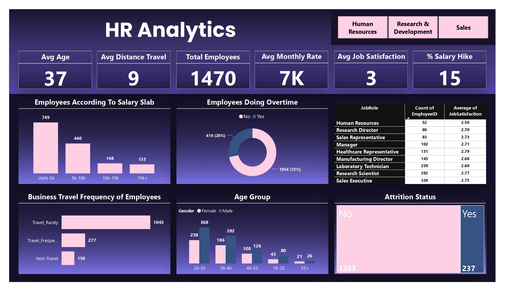

# HR Analysis

This Project created by Nisrag Bsc.Data

## Table of Contents
- [Screenshots](#screenshots)
- [Features](#features)
- [Installation](#installation)

## Screenshots

Include screenshots or images showcasing your project. Use relative paths for images inside your project.




## Features

🚀 Excited to share the power of HR Analytics through our newly developed Power BI Dashboard! 📊✨

Unlocking key insights into our workforce, this dashboard is a game-changer for strategic HR decisions. 🌐💼

📈 Key Performance Indicators (KPIs):

🎂 Average Age
🌍 Average Distance Traveled
👥 Total Employees
💵 Average Monthly Rate
😊 Average Job Satisfaction
💰 % Salary Hike
📊 Insightful Charts:

📊 Employees Count According To Salary Slab
🚗 Business Travel Frequency of Employees
👩‍🦳👨‍🦱 Age Group Distribution
🔄 Attrition Status
🕰 Employees Doing Overtime
🧑‍💼 Job Role with Employee Count and Average Job Satisfaction
This comprehensive dashboard empowers our HR team to make data-driven decisions, fostering a more engaged and satisfied workforce. 🌟

## Installation

Provide instructions on how to install your project. You can include code snippets or commands.

```bash
npm install your-package-name
